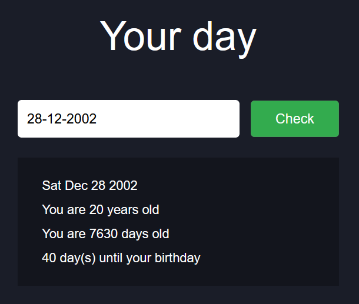

## BIRTHDAY CHECKER

This is a simple tool designed to calculate your age and how many days until your birthday.

### Built With

  &nbsp;
  &nbsp;
  &nbsp;

## Demo
Click [here](https://bernardoyewole.github.io/birthday-checker/) to open.

A demo is show below:

